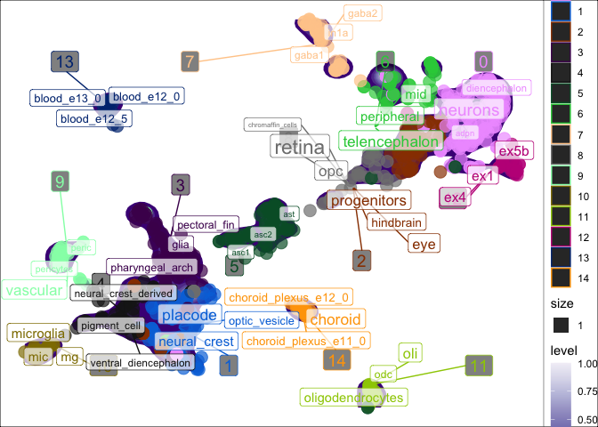

scNLP
================
<h5>
Author: <i>Brian M. Schilder</i>
</h5>
<h5>
Most recent update: <i>Jun-30-2021</i>
</h5>

## Tools for applying natural language processing (NLP) techniques to single-cell (sc) omics data.

# Intro

When trying to re-analyze single-cell \[RNA-seq\] data that has
previously been annotated, the same cell-types are not usually labeled
in the same way (e.g. “Purkinje cells” vs. “purkinje neurons”
vs. “pkj\_neurons”). This makes harmonizing data across multiple source
quite challenging. One solution is to re-annotate all cells yourself.
Alternatively, you can re-use the existing cell-type labels with natural
language processing (NLP).

Term frequency–inverse document frequency (**tf-idf**) is an NLP
technique to identify words or phrases that are enriched in one document
relative to some other larger set of documents.

In our case, our words are within the non-standardized cell labels and
our “documents” are the clusters. The goals is to find words that are
enriched in each cluster relative to all the other clusters. This can be
thought of as an NLP equivalent of finding gene markers for each
cluster.

Another use case is to identify whether certain metadata attributes
(e.g. dataset, species, brain region) are over-represented in some
clusters relative to others This is a quantitative way to assess
whether, for example, two or more datasets have successfully been
integrated (i.e. are well-“mixed”), or whether some clusters are more
representative of a particular anatomical region.

# [Documentation website](https://neurogenomics.github.io/scNLP/)

# [tf-idf vignette](https://neurogenomics.github.io/scNLP/articles/tf-idf.html)

# Quick examples

``` r
library(scNLP) 
data("pseudo_seurat")
```

## td-idf annotation

`seurat_tfidf` will run **tf-idf** on each cluster and put the results
in the **enriched\_words** and **tf\_idf** cols of the `meta.data`.

``` r
pseudo_seurat <- run_tfidf(object = pseudo_seurat,
                           reduction = "UMAP",
                           cluster_var = "cluster",
                           label_var = "celltype") 
```

    ## Loading required package: SeuratObject

    ## [1] "+ Extracting data from Seurat object."
    ## [1] "+ Using reduction: umap"
    ## [1] "+ Dropping 2 conflicting metadata variables: UMAP.1, UMAP.2"

    ## Joining, by = "word"

    ## Joining, by = "cluster"
    ## Joining, by = "cluster"

``` r
head(pseudo_seurat@meta.data)
```

    ##                         cluster       batch species     dataset celltype label
    ## human.DRONC_human.ASC1        5 DRONC_human   human DRONC_human     ASC1  ASC1
    ## human.DRONC_human.ASC2        5 DRONC_human   human DRONC_human     ASC2  ASC2
    ## human.DRONC_human.END         9 DRONC_mouse   mouse DRONC_mouse      END   END
    ## human.DRONC_human.exCA1       0 DRONC_human   human DRONC_human    exCA1 exCA1
    ## human.DRONC_human.exCA3       0 DRONC_human   human DRONC_human    exCA3 exCA3
    ## human.DRONC_human.exDG        0 DRONC_human   human DRONC_human     exDG  exDG
    ##                         nCount_RNA nFeature_RNA RNA_snn_res.0.8 seurat_clusters
    ## human.DRONC_human.ASC1    237.9283          671               5               5
    ## human.DRONC_human.ASC2    232.7748          638               5               5
    ## human.DRONC_human.END     288.9631          616               9               9
    ## human.DRONC_human.exCA1   245.1858          669               0               0
    ## human.DRONC_human.exCA3   225.1575          675               0               0
    ## human.DRONC_human.exDG    237.8823          678               0               0
    ##                             UMAP_1      UMAP_2             enriched_words
    ## human.DRONC_human.ASC1  -0.4796632  0.17629431      glia; schwann; radial
    ## human.DRONC_human.ASC2  -0.6386602 -0.05231967      glia; schwann; radial
    ## human.DRONC_human.END   -7.7066403 -1.84134831 vascular; peric; pericytes
    ## human.DRONC_human.exCA1  6.2326443  1.51104526          lpn; adpn; neuron
    ## human.DRONC_human.exCA3  6.0303471  1.47096417          lpn; adpn; neuron
    ## human.DRONC_human.exDG   5.9316036  1.49563257          lpn; adpn; neuron
    ##                                                                             tf_idf
    ## human.DRONC_human.ASC1     0.198360552120631; 0.181900967132288; 0.111766521696813
    ## human.DRONC_human.ASC2     0.198360552120631; 0.181900967132288; 0.111766521696813
    ## human.DRONC_human.END                         0.528096815017439; 0.042313284392222
    ## human.DRONC_human.exCA1 0.0527542246967963; 0.0523351433907082; 0.0428030761818744
    ## human.DRONC_human.exCA3 0.0527542246967963; 0.0523351433907082; 0.0428030761818744
    ## human.DRONC_human.exDG  0.0527542246967963; 0.0523351433907082; 0.0428030761818744

## td-idf scatter plot

You can also plot the results in reduced dimensional space (e.g. UMAP).
`plot_tfidf()` will produce a list with three items.

-   `data`: The processed data used to create the plot.
-   `tfidf_df`: The full per-cluster TF-IDF enrichment results.
-   `plot`: The `ggplot`.

### `Seurat` input

``` r
res <- plot_tfidf(object = pseudo_seurat, 
                  label_var = "celltype", 
                  cluster_var = "cluster", 
                  show_plot = T)
```

    ## [1] "+ Extracting data from Seurat object."
    ## [1] "+ Using reduction: umap"
    ## [1] "+ Dropping 2 conflicting metadata variables: UMAP_1, UMAP_2"

    ## Joining, by = "word"

    ## Joining, by = "cluster"
    ## Joining, by = "cluster"

    ## Warning: Ignoring unknown aesthetics: label

<!-- -->

## Search nearest neighbors

Find the nearest neighbors to terms matching `var1_search`.

``` r
top_neighbors <- search_neighbors(seurat = pseudo_seurat,
                                  var1_search = "purkinje",
                                  max_neighbors=5)
```

    ## [1] "No variable features detected. Computing"
    ## [1] "No PCA detected. Computing"

    ## Centering and scaling data matrix

    ## PC_ 1 
    ## Positive:  RASGRF2, KCNC2, FRRS1L, CBX7, NIPAL2, ZBTB41, DGKE, DOC2A, FMN1, CNKSR2 
    ##     MAST1, RBM4, BTBD8, RAPGEF4, JDP2, HCN1, DOCK3, LMTK2, NAB1, RAP1GAP2 
    ##     INTU, ADNP2, PARP11, CCDC136, PHF1, ARHGAP26, GALNT13, INPP5E, SYNPR, BMS1 
    ## Negative:  GAPDHS, ALG10, SAP18, AGPAT6, IFI30, ATP6V1B1, CBS, HMGB2, RNA28S5, PHYHD1 
    ##     PAM16, WNT11, MCM5, SLC7A4, RNMTL1, GNAT2, TMEM184A, PHOX2B, RPSA, RDH13 
    ##     BOLA1, GSX2, TMX2, RPS19, EPCAM, ERCC6L, SLC38A4, MAD2L1, SERINC2, ALG11 
    ## PC_ 2 
    ## Positive:  UMAD1, SNHG22, MIR646HG, AC007193.6, CTD-2020K17.1, C1QTNF3-AMACR, AC092835.2, CFL1P1, LINC-PINT, AC009403.2 
    ##     LINS1, RP11-113E21.3, FAAH2, RP11-3B12.2, CTD-3105H18.18, RP11-11N7.5, CTB-171A8.1, RP11-848P1.9, USP32P3, TARID 
    ##     AC091133.1, RP11-1007O24.3, RP11-894J14.5, RP11-144F15.1, RP11-146D12.2, SDHAP1, RP1-184J9.2, RP11-1084E5.1, SCAMP1-AS1, RP11-382A20.4 
    ## Negative:  GPRASP1, HAGHL, ZNF664, EIF4G1, CRYZL1, UQCR11, FAM195A, LOC102288414, FNIP1, PYCR2 
    ##     EPHB3, CD320, MARS2, PDLIM2, ABCD1, AKT1S1, KISS1R, RWDD3, TMEM256, PCDHGC5 
    ##     C8orf37, MAZ, CHERP, BLOC1S3, DGAT2, GRPEL1, ZDHHC12, TMED1, EIF6, XBP1 
    ## PC_ 3 
    ## Positive:  RDH13, SLC7A4, RNMTL1, IFI30, AGPAT6, ALG11, TMEM179, CYB5D2, CBS, ALG10 
    ##     FKRP, AGO2, TTLL12, SGSM3, MAN1B1, MROH1, TMX2, TADA1, C15orf61, PAF1 
    ##     PHYHD1, PRPSAP2, RBM18, MESDC2, HEATR6, CAT, CBFB, MPDU1, FAF1, CCDC47 
    ## Negative:  RPS19, RPSA, HMGB2, CCT5, EIF3E, COX5A, TUBB, EIF3K, CLTA, SSR2 
    ##     PSMD8, SKP1, VDAC3, MYL12B, EIF3D, HSPD1, MLF2, SFPQ, MED10, EIF5B 
    ##     SYNCRIP, PRPF19, EIF6, ATP5L, C1D, MCM5, CHD4, RUVBL1, NIP7, MRPS21 
    ## PC_ 4 
    ## Positive:  ZNF285, ZNF468, RN7SL220P, RN7SL460P, DLEU2L, FAM241B, TMSB4Y, ZBTB20-AS4, ZNF781, PILRB 
    ##     ATAD3C, MTRNR2L1, CALM2, NBPF9, ZNF571-AS1, ANKK1, ZNF132, ZNF621, CDNF, PHLDB3 
    ##     BEST1, SLC2A1-AS1, ZNF66, HRH4, ZNF415, ZNF234, CCDC74B, ZNF554, FMNL1, SLCO1A2 
    ## Negative:  TMEM55A, UQCR11, C11orf57, TMEM234, SUV420H2, PAM16, C14orf79, AC084193.1, RP11-396J6.1, IMPG1 
    ##     RP11-122C21.1, RP11-556I14.1, RNMTL1, RP3-417G15.1, CNBD2, RP1-102E24.1, CTD-3222D19.12, RP11-486O12.2, RP11-615I2.6, CACNG5 
    ##     WBSCR27, PGLS, LOC102288414, SLC7A4, RP11-57A19.4, CTC-448D22.1, RP11-147L13.15, FAM195A, BOLA1, RP11-398M15.1 
    ## PC_ 5 
    ## Positive:  PGLS, MT1A, MTRNR2L1, LINC00571, ZNF132, ATAD3C, CXorf40A, TMEM234, AC084193.1, RP11-486O12.2 
    ##     RP11-615I2.6, CTD-3222D19.12, RP1-102E24.1, RP11-556I14.1, IMPG1, RP11-122C21.1, RP3-417G15.1, RP11-147L13.15, RP11-396J6.1, RP11-332J15.1 
    ##     RP11-57A19.4, RP11-731N10.1, RP11-49K24.4, RP4-758J18.13, RP11-569A11.1, CTC-248O19.1, RP11-395N3.2, TMED11P, RP11-398M15.1, CTC-448D22.1 
    ## Negative:  WHSC1, ANKRD32, C19orf40, HCN1, RASGRF2, LOC102288414, GABRB2, CHRM4, C6orf211, RP11-195B21.3 
    ##     AGAP9, KIAA2018, FSTL5, C1orf86, RAB1A, NARG2, C10orf118, ATP5L, DSCAML1, CCBL1 
    ##     KIAA0247, GPR61, KCNC2, C2CD4C, PLPP6, RP11-146D12.2, PTCHD1, KCNC1, RP11-897M7.4, RAP1GAP2

    ## [1] "No graphs detected. Computing."

    ## Computing nearest neighbor graph

    ## Computing SNN

    ## [1] "Using graph: RNA_snn"
    ## [1] "+ Filtering results by `var1_search`: purkinje"
    ## [1] "+ 3 entries matching `var1_search` identified."
    ## [1] "+ Adding original names to results"
    ## [1] "+ Returning 19 pair-wise similarities."

``` r
print(top_neighbors)
```

    ##                                                  Var1
    ##  1:                zebrafish.Raj2020.purkinje_neurons
    ##  2:                zebrafish.Raj2020.purkinje_neurons
    ##  3: zebrafish.Raj2020.purkinje_neurons_.gabaergic_...
    ##  4: zebrafish.Raj2020.purkinje_neurons_.gabaergic_...
    ##  5:                zebrafish.Raj2020.purkinje_neurons
    ##  6:      human.descartes_SampledData.Purkinje_neurons
    ##  7:                zebrafish.Raj2020.purkinje_neurons
    ##  8: zebrafish.Raj2020.purkinje_neurons_.gabaergic_...
    ##  9:      human.descartes_SampledData.Purkinje_neurons
    ## 10:                zebrafish.Raj2020.purkinje_neurons
    ## 11:                zebrafish.Raj2020.purkinje_neurons
    ## 12: zebrafish.Raj2020.purkinje_neurons_.gabaergic_...
    ## 13: zebrafish.Raj2020.purkinje_neurons_.gabaergic_...
    ## 14: zebrafish.Raj2020.purkinje_neurons_.gabaergic_...
    ## 15: zebrafish.Raj2020.purkinje_neurons_.gabaergic_...
    ## 16:      human.descartes_SampledData.Purkinje_neurons
    ## 17:      human.descartes_SampledData.Purkinje_neurons
    ## 18:      human.descartes_SampledData.Purkinje_neurons
    ## 19:      human.descartes_SampledData.Purkinje_neurons
    ##                                                                        Var2
    ##  1: zebrafish.Raj2020.progenitors.differentiating_granule_cells_.hindbrain.
    ##  2:                     zebrafish.Raj2020.neurons_.glutamatergic._midbrain.
    ##  3:                                      zebrafish.Raj2020.oligodendrocytes
    ##  4:                                  zebrafish.Raj2020.midbrain_.gabaergic.
    ##  5:                                           zebrafish.Raj2020.radial_glia
    ##  6:                                 human.descartes_SampledData.ENS_neurons
    ##  7:        zebrafish.Raj2020.ventral_forebrain_.dienc._hyp._poa._gabaergic.
    ##  8:                          zebrafish.Raj2020.retina_.amacrine._gabaergic.
    ##  9:                            human.descartes_SampledData.Visceral_neurons
    ## 10:                        zebrafish.Raj2020.dorsal_habenula._glutamatergic
    ## 11:                                       zebrafish.Raj2020.pharyngeal_arch
    ## 12:                                  zebrafish.Raj2020.retina_.muller_glia.
    ## 13:        zebrafish.Raj2020.neurons_.gabaergic_..._midbrain._optic_tectum.
    ## 14:                  zebrafish.Raj2020.dorsal_telencephalon_.glutamatergic.
    ## 15:                      zebrafish.Raj2020.neurons_.dienc._differentiating.
    ## 16:                     human.descartes_SampledData.Inhibitory_interneurons
    ## 17:                  human.descartes_SampledData.SATB2_LRRC7_positive_cells
    ## 18:                            human.descartes_SampledData.Oligodendrocytes
    ## 19:                       human.descartes_SampledData.Islet_endocrine_cells
    ##     similarity                                           Var1_id
    ##  1:  0.6000000                zebrafish.Raj2020.purkinje_neurons
    ##  2:  0.6000000                zebrafish.Raj2020.purkinje_neurons
    ##  3:  0.6000000 zebrafish.Raj2020.purkinje_neurons_.gabaergic_...
    ##  4:  0.6000000 zebrafish.Raj2020.purkinje_neurons_.gabaergic_...
    ##  5:  0.5384615                zebrafish.Raj2020.purkinje_neurons
    ##  6:  0.4814815      human.descartes_SampledData.Purkinje_neurons
    ##  7:  0.4814815                zebrafish.Raj2020.purkinje_neurons
    ##  8:  0.4814815 zebrafish.Raj2020.purkinje_neurons_.gabaergic_...
    ##  9:  0.4285714      human.descartes_SampledData.Purkinje_neurons
    ## 10:  0.4285714                zebrafish.Raj2020.purkinje_neurons
    ## 11:  0.4285714                zebrafish.Raj2020.purkinje_neurons
    ## 12:  0.4285714 zebrafish.Raj2020.purkinje_neurons_.gabaergic_...
    ## 13:  0.4285714 zebrafish.Raj2020.purkinje_neurons_.gabaergic_...
    ## 14:  0.4285714 zebrafish.Raj2020.purkinje_neurons_.gabaergic_...
    ## 15:  0.4285714 zebrafish.Raj2020.purkinje_neurons_.gabaergic_...
    ## 16:  0.3793103      human.descartes_SampledData.Purkinje_neurons
    ## 17:  0.3793103      human.descartes_SampledData.Purkinje_neurons
    ## 18:  0.3333333      human.descartes_SampledData.Purkinje_neurons
    ## 19:  0.3333333      human.descartes_SampledData.Purkinje_neurons
    ##                                                                     Var2_id
    ##  1: zebrafish.Raj2020.progenitors.differentiating_granule_cells_.hindbrain.
    ##  2:                     zebrafish.Raj2020.neurons_.glutamatergic._midbrain.
    ##  3:                                      zebrafish.Raj2020.oligodendrocytes
    ##  4:                                  zebrafish.Raj2020.midbrain_.gabaergic.
    ##  5:                                           zebrafish.Raj2020.radial_glia
    ##  6:                                 human.descartes_SampledData.ENS_neurons
    ##  7:        zebrafish.Raj2020.ventral_forebrain_.dienc._hyp._poa._gabaergic.
    ##  8:                          zebrafish.Raj2020.retina_.amacrine._gabaergic.
    ##  9:                            human.descartes_SampledData.Visceral_neurons
    ## 10:                        zebrafish.Raj2020.dorsal_habenula._glutamatergic
    ## 11:                                       zebrafish.Raj2020.pharyngeal_arch
    ## 12:                                  zebrafish.Raj2020.retina_.muller_glia.
    ## 13:        zebrafish.Raj2020.neurons_.gabaergic_..._midbrain._optic_tectum.
    ## 14:                  zebrafish.Raj2020.dorsal_telencephalon_.glutamatergic.
    ## 15:                      zebrafish.Raj2020.neurons_.dienc._differentiating.
    ## 16:                     human.descartes_SampledData.Inhibitory_interneurons
    ## 17:                  human.descartes_SampledData.SATB2_LRRC7_positive_cells
    ## 18:                            human.descartes_SampledData.Oligodendrocytes
    ## 19:                       human.descartes_SampledData.Islet_endocrine_cells

# Session Info

<details>

``` r
utils::sessionInfo()
```

    ## R version 4.1.0 (2021-05-18)
    ## Platform: x86_64-apple-darwin17.0 (64-bit)
    ## Running under: macOS Big Sur 10.16
    ## 
    ## Matrix products: default
    ## BLAS:   /Library/Frameworks/R.framework/Versions/4.1/Resources/lib/libRblas.dylib
    ## LAPACK: /Library/Frameworks/R.framework/Versions/4.1/Resources/lib/libRlapack.dylib
    ## 
    ## locale:
    ## [1] en_GB.UTF-8/en_GB.UTF-8/en_GB.UTF-8/C/en_GB.UTF-8/en_GB.UTF-8
    ## 
    ## attached base packages:
    ## [1] stats     graphics  grDevices utils     datasets  methods   base     
    ## 
    ## other attached packages:
    ## [1] ggplot2_3.3.5      tidytext_0.3.1     SeuratObject_4.0.2 scNLP_0.1.0       
    ## 
    ## loaded via a namespace (and not attached):
    ##   [1] Seurat_4.0.3          Rtsne_0.15            colorspace_2.0-2     
    ##   [4] deldir_0.2-10         ellipsis_0.3.2        class_7.3-19         
    ##   [7] ggridges_0.5.3        gld_2.6.2             dichromat_2.0-0      
    ##  [10] spatstat.data_2.1-0   rstudioapi_0.13       proxy_0.4-26         
    ##  [13] leiden_0.3.8          listenv_0.8.0         farver_2.1.0         
    ##  [16] SnowballC_0.7.0       ggrepel_0.9.1         fansi_0.5.0          
    ##  [19] mvtnorm_1.1-2         codetools_0.2-18      splines_4.1.0        
    ##  [22] rootSolve_1.8.2.1     knitr_1.33            polyclip_1.10-0      
    ##  [25] jsonlite_1.7.2        ica_1.0-2             cluster_2.1.2        
    ##  [28] png_0.1-7             uwot_0.1.10           spatstat.sparse_2.0-0
    ##  [31] sctransform_0.3.2     shiny_1.6.0           mapproj_1.2.7        
    ##  [34] compiler_4.1.0        httr_1.4.2            assertthat_0.2.1     
    ##  [37] Matrix_1.3-4          fastmap_1.1.0         lazyeval_0.2.2       
    ##  [40] later_1.2.0           htmltools_0.5.1.1     tools_4.1.0          
    ##  [43] igraph_1.2.6          gtable_0.3.0          glue_1.4.2           
    ##  [46] lmom_2.8              reshape2_1.4.4        RANN_2.6.1           
    ##  [49] dplyr_1.0.7           maps_3.3.0            Rcpp_1.0.6           
    ##  [52] scattermore_0.7       vctrs_0.3.8           nlme_3.1-152         
    ##  [55] lmtest_0.9-38         xfun_0.24             stringr_1.4.0        
    ##  [58] globals_0.14.0        mime_0.11             miniUI_0.1.1.1       
    ##  [61] lifecycle_1.0.0       irlba_2.3.3           goftest_1.2-2        
    ##  [64] future_1.21.0         MASS_7.3-54           zoo_1.8-9            
    ##  [67] scales_1.1.1          spatstat.core_2.2-0   spatstat.utils_2.2-0 
    ##  [70] promises_1.2.0.1      parallel_4.1.0        expm_0.999-6         
    ##  [73] RColorBrewer_1.1-2    yaml_2.2.1            Exact_2.1            
    ##  [76] gridExtra_2.3         reticulate_1.20       pbapply_1.4-3        
    ##  [79] rpart_4.1-15          stringi_1.6.2         highr_0.9            
    ##  [82] tokenizers_0.2.1      e1071_1.7-7           boot_1.3-28          
    ##  [85] pals_1.7              rlang_0.4.11          pkgconfig_2.0.3      
    ##  [88] matrixStats_0.59.0    evaluate_0.14         lattice_0.20-44      
    ##  [91] tensor_1.5            ROCR_1.0-11           purrr_0.3.4          
    ##  [94] patchwork_1.1.1       htmlwidgets_1.5.3     labeling_0.4.2       
    ##  [97] cowplot_1.1.1         tidyselect_1.1.1      parallelly_1.26.0    
    ## [100] RcppAnnoy_0.0.18      plyr_1.8.6            magrittr_2.0.1       
    ## [103] R6_2.5.0              DescTools_0.99.42     generics_0.1.0       
    ## [106] DBI_1.1.1             mgcv_1.8-36           pillar_1.6.1         
    ## [109] withr_2.4.2           fitdistrplus_1.1-5    abind_1.4-5          
    ## [112] survival_3.2-11       tibble_3.1.2          future.apply_1.7.0   
    ## [115] janeaustenr_0.1.5     crayon_1.4.1          KernSmooth_2.23-20   
    ## [118] utf8_1.2.1            spatstat.geom_2.2-0   plotly_4.9.4.1       
    ## [121] rmarkdown_2.9         grid_4.1.0            isoband_0.2.4        
    ## [124] data.table_1.14.0     digest_0.6.27         xtable_1.8-4         
    ## [127] tidyr_1.1.3           httpuv_1.6.1          munsell_0.5.0        
    ## [130] viridisLite_0.4.0

</details>
