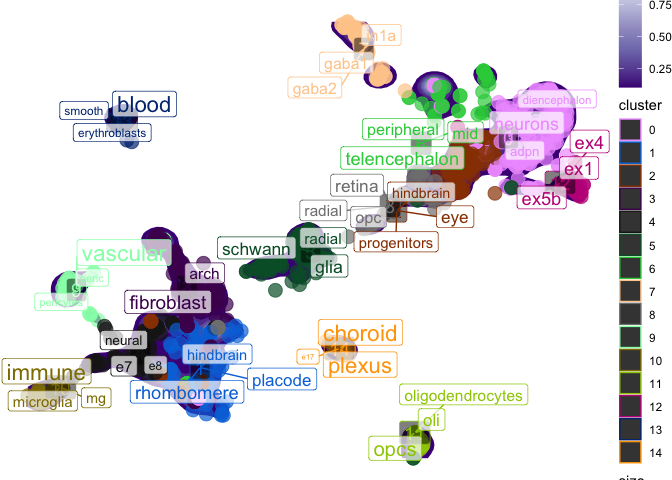

scNLP
================
<br>
[](https://cran.r-project.org/web/licenses/MIT%20+%20file%20LICENSE)
[](https://github.com/neurogenomics/scNLP)
[](https://github.com/neurogenomics/scNLP)
[](https://github.com/neurogenomics/scNLP/commits/main)
<br> [](https://github.com/neurogenomics/scNLP/actions)
[](https://app.codecov.io/gh/neurogenomics/scNLP)
<br>
<a href='https://app.codecov.io/gh/neurogenomics/scNLP/tree/main' target='_blank'></a>  
<h4>  
Authors: <i>Brian Schilder, Nathan Skene</i>  
</h4>
<h5>  
README updated: <i>Jan-25-2026</i>  
</h5>

## Tools for applying natural language processing (NLP) techniques to single-cell (sc) omics data.

# Intro

When trying to re-analyze single-cell \[RNA-seq\] data that has
previously been annotated, the same cell-types are not usually labeled
in the same way (e.g. “Purkinje cells” vs. “purkinje neurons”
vs. “pkj_neurons”). This makes harmonizing data across multiple source
quite challenging. One solution is to re-annotate all cells yourself.
Alternatively, you can re-use the existing cell-type labels with natural
language processing (NLP).

Term frequency–inverse document frequency (**tf-idf**) is an NLP
technique to identify words or phrases that are enriched in one document
relative to some other larger set of documents.

In our case, our words are within the non-standardized cell labels and
our “documents” are the clusters. The goals is to find words that are
enriched in each cluster relative to all the other clusters. This can be
thought of as an NLP equivalent of finding gene markers for each
cluster.

Another use case is to identify whether certain metadata attributes
(e.g. dataset, species, brain region) are over-represented in some
clusters relative to others This is a quantitative way to assess
whether, for example, two or more datasets have successfully been
integrated (i.e. are well-“mixed”), or whether some clusters are more
representative of a particular anatomical region.

# [Documentation website](https://neurogenomics.github.io/scNLP/)

## [Get started](https://neurogenomics.github.io/scNLP/articles/scNLP.html)

## [tf-idf vignette](https://neurogenomics.github.io/scNLP/articles/tf-idf.html)

## [Docker/Singularity vignette](https://neurogenomics.github.io/scNLP/articles/docker.html)

# Quick examples

``` r
library(scNLP) 
data("pseudo_seurat")
```

## td-idf annotation

`seurat_tfidf` will run **tf-idf** on each cluster and put the results
in the **enriched_words** and **tf_idf** cols of the `meta.data`.

``` r
pseudo_seurat <- run_tfidf(obj = pseudo_seurat,
                           reduction = "UMAP",
                           cluster_var = "cluster",
                           label_var = "celltype") 
```

    ## Extracting obsm from Seurat: umap

    ## + Dropping 2 conflicting obs variables: UMAP.1, UMAP.2

    ## Loading required namespace: tidytext

    ## Setting cell metadata (obs) in obj.

``` r
head(pseudo_seurat@meta.data)
```

    ##                         cluster       batch species     dataset celltype label
    ## human.DRONC_human.ASC1        5 DRONC_human   human DRONC_human     ASC1  ASC1
    ## human.DRONC_human.ASC2        5 DRONC_human   human DRONC_human     ASC2  ASC2
    ## human.DRONC_human.END         9 DRONC_mouse   mouse DRONC_mouse      END   END
    ## human.DRONC_human.exCA1       0 DRONC_human   human DRONC_human    exCA1 exCA1
    ## human.DRONC_human.exCA3       0 DRONC_human   human DRONC_human    exCA3 exCA3
    ## human.DRONC_human.exDG        0 DRONC_human   human DRONC_human     exDG  exDG
    ##                         nCount_RNA nFeature_RNA RNA_snn_res.0.8 seurat_clusters
    ## human.DRONC_human.ASC1    756.6266         1693               5               5
    ## human.DRONC_human.ASC2    766.3392         1603               5               5
    ## human.DRONC_human.END     885.2824         1645               9               9
    ## human.DRONC_human.exCA1   714.6469         1677               0               0
    ## human.DRONC_human.exCA3   634.1760         1657               0               0
    ## human.DRONC_human.exDG    659.2845         1700               0               0
    ##                             UMAP_1      UMAP_2             enriched_words
    ## human.DRONC_human.ASC1  -0.4796632  0.17629431      glia; schwann; radial
    ## human.DRONC_human.ASC2  -0.6386602 -0.05231967      glia; schwann; radial
    ## human.DRONC_human.END   -7.7066403 -1.84134831 vascular; peric; pericytes
    ## human.DRONC_human.exCA1  6.2326443  1.51104526          lpn; adpn; neuron
    ## human.DRONC_human.exCA3  6.0303471  1.47096417          lpn; adpn; neuron
    ## human.DRONC_human.exDG   5.9316036  1.49563257          lpn; adpn; neuron
    ##                                                                             tf_idf
    ## human.DRONC_human.ASC1     0.198360552120631; 0.181900967132288; 0.111766521696813
    ## human.DRONC_human.ASC2     0.198360552120631; 0.181900967132288; 0.111766521696813
    ## human.DRONC_human.END                         0.528096815017439; 0.042313284392222
    ## human.DRONC_human.exCA1 0.0527542246967963; 0.0523351433907082; 0.0428030761818744
    ## human.DRONC_human.exCA3 0.0527542246967963; 0.0523351433907082; 0.0428030761818744
    ## human.DRONC_human.exDG  0.0527542246967963; 0.0523351433907082; 0.0428030761818744

## td-idf scatter plot

You can also plot the results in reduced dimensional space (e.g. UMAP).
`plot_tfidf()` will produce a list with three items.

- `data`: The processed data used to create the plot.
- `tfidf_df`: The full per-cluster TF-IDF enrichment results.
- `plot`: The `ggplot`.

### `Seurat` input

``` r
res <- plot_tfidf(obj = pseudo_seurat, 
                  label_var = "celltype", 
                  cluster_var = "cluster", 
                  show_plot = TRUE)
```

    ## Extracting obsm from Seurat: umap

    ## + Dropping 2 conflicting obs variables: UMAP_1, UMAP_2

    ## Setting cell metadata (obs) in obj.

    ## Warning: `aes_string()` was deprecated in ggplot2 3.0.0.
    ## ℹ Please use tidy evaluation idioms with `aes()`.
    ## ℹ See also `vignette("ggplot2-in-packages")` for more information.
    ## ℹ The deprecated feature was likely used in the scNLP package.
    ##   Please report the issue at <https://github.com/neurogenomics/scNLP/issues>.
    ## This warning is displayed once per session.
    ## Call `lifecycle::last_lifecycle_warnings()` to see where this warning was
    ## generated.

    ## Warning in ggplot2::geom_point(ggplot2::aes_string(color = color_var, size =
    ## size_var, : Ignoring unknown aesthetics: label

    ## Warning: Using `size` aesthetic for lines was deprecated in ggplot2 3.4.0.
    ## ℹ Please use `linewidth` instead.
    ## ℹ The deprecated feature was likely used in the scNLP package.
    ##   Please report the issue at <https://github.com/neurogenomics/scNLP/issues>.
    ## This warning is displayed once per session.
    ## Call `lifecycle::last_lifecycle_warnings()` to see where this warning was
    ## generated.

<!-- -->

# Session Info

<details>

``` r
utils::sessionInfo()
```

    ## R version 4.5.1 (2025-06-13)
    ## Platform: aarch64-apple-darwin20
    ## Running under: macOS Tahoe 26.1
    ## 
    ## Matrix products: default
    ## BLAS:   /Library/Frameworks/R.framework/Versions/4.5-arm64/Resources/lib/libRblas.0.dylib 
    ## LAPACK: /Library/Frameworks/R.framework/Versions/4.5-arm64/Resources/lib/libRlapack.dylib;  LAPACK version 3.12.1
    ## 
    ## locale:
    ## [1] en_US.UTF-8/en_US.UTF-8/en_US.UTF-8/C/en_US.UTF-8/en_US.UTF-8
    ## 
    ## time zone: America/New_York
    ## tzcode source: internal
    ## 
    ## attached base packages:
    ## [1] stats     graphics  grDevices utils     datasets  methods   base     
    ## 
    ## other attached packages:
    ## [1] scNLP_0.99.0
    ## 
    ## loaded via a namespace (and not attached):
    ##   [1] RcppAnnoy_0.0.23            splines_4.5.1              
    ##   [3] later_1.4.5                 filelock_1.0.3             
    ##   [5] tibble_3.3.1                polyclip_1.10-7            
    ##   [7] fastDummies_1.7.5           lifecycle_1.0.5            
    ##   [9] httr2_1.2.2                 rprojroot_2.1.1            
    ##  [11] pals_1.10                   globals_0.18.0             
    ##  [13] lattice_0.22-7              MASS_7.3-65                
    ##  [15] alabaster.base_1.10.0       SnowballC_0.7.1            
    ##  [17] magrittr_2.0.4              plotly_4.12.0              
    ##  [19] rmarkdown_2.30              yaml_2.3.12                
    ##  [21] dlstats_0.1.7               httpuv_1.6.16              
    ##  [23] otel_0.2.0                  Seurat_5.4.0               
    ##  [25] sctransform_0.4.3           spam_2.11-3                
    ##  [27] sp_2.2-0                    spatstat.sparse_3.1-0      
    ##  [29] reticulate_1.44.1           mapproj_1.2.12             
    ##  [31] cowplot_1.2.0               pbapply_1.7-4              
    ##  [33] DBI_1.2.3                   RColorBrewer_1.1-3         
    ##  [35] maps_3.4.3                  abind_1.4-8                
    ##  [37] GenomicRanges_1.62.1        rvcheck_0.2.1              
    ##  [39] Rtsne_0.17                  purrr_1.2.1                
    ##  [41] BiocGenerics_0.56.0         yulab.utils_0.2.3          
    ##  [43] rappdirs_0.3.4              rworkflows_1.0.8           
    ##  [45] IRanges_2.44.0              S4Vectors_0.48.0           
    ##  [47] ggrepel_0.9.6               tokenizers_0.3.0           
    ##  [49] irlba_2.3.5.1               listenv_0.10.0             
    ##  [51] spatstat.utils_3.2-1        goftest_1.2-3              
    ##  [53] RSpectra_0.16-2             spatstat.random_3.4-4      
    ##  [55] fitdistrplus_1.2-6          parallelly_1.46.1          
    ##  [57] DelayedMatrixStats_1.32.0   codetools_0.2-20           
    ##  [59] DelayedArray_0.36.0         tidyselect_1.2.1           
    ##  [61] farver_2.1.2                matrixStats_1.5.0          
    ##  [63] stats4_4.5.1                BiocFileCache_3.0.0        
    ##  [65] spatstat.explore_3.7-0      Seqinfo_1.0.0              
    ##  [67] jsonlite_2.0.0              progressr_0.18.0           
    ##  [69] ggridges_0.5.7              survival_3.8-6             
    ##  [71] tools_4.5.1                 ica_1.0-3                  
    ##  [73] Rcpp_1.1.1                  glue_1.8.0                 
    ##  [75] gridExtra_2.3               SparseArray_1.10.8         
    ##  [77] xfun_0.56                   here_1.0.2                 
    ##  [79] MatrixGenerics_1.22.0       HDF5Array_1.38.0           
    ##  [81] gypsum_1.6.0                dplyr_1.1.4                
    ##  [83] withr_3.0.2                 BiocManager_1.30.27        
    ##  [85] fastmap_1.2.0               rhdf5filters_1.22.0        
    ##  [87] digest_0.6.39               R6_2.6.1                   
    ##  [89] mime_0.13                   colorspace_2.1-2           
    ##  [91] scattermore_1.2             tensor_1.5.1               
    ##  [93] dichromat_2.0-0.1           spatstat.data_3.1-9        
    ##  [95] RSQLite_2.4.5               h5mread_1.2.1              
    ##  [97] celldex_1.20.0              tidyr_1.3.2                
    ##  [99] generics_0.1.4              renv_1.1.6                 
    ## [101] data.table_1.18.0           httr_1.4.7                 
    ## [103] htmlwidgets_1.6.4           S4Arrays_1.10.1            
    ## [105] uwot_0.2.4                  pkgconfig_2.0.3            
    ## [107] gtable_0.3.6                blob_1.3.0                 
    ## [109] lmtest_0.9-40               S7_0.2.1                   
    ## [111] XVector_0.50.0              janeaustenr_1.0.0          
    ## [113] htmltools_0.5.9             dotCall64_1.2              
    ## [115] alabaster.matrix_1.10.0     SeuratObject_5.3.0         
    ## [117] scales_1.4.0                Biobase_2.70.0             
    ## [119] png_0.1-8                   spatstat.univar_3.1-6      
    ## [121] knitr_1.51                  rstudioapi_0.18.0          
    ## [123] reshape2_1.4.5              badger_0.2.5               
    ## [125] nlme_3.1-168                curl_7.0.0                 
    ## [127] rhdf5_2.54.1                zoo_1.8-15                 
    ## [129] cachem_1.1.0                stringr_1.6.0              
    ## [131] BiocVersion_3.22.0          KernSmooth_2.23-26         
    ## [133] parallel_4.5.1              miniUI_0.1.2               
    ## [135] AnnotationDbi_1.72.0        desc_1.4.3                 
    ## [137] alabaster.schemas_1.10.0    pillar_1.11.1              
    ## [139] grid_4.5.1                  vctrs_0.7.1                
    ## [141] RANN_2.6.2                  promises_1.5.0             
    ## [143] dbplyr_2.5.1                xtable_1.8-4               
    ## [145] cluster_2.1.8.1             evaluate_1.0.5             
    ## [147] isoband_0.3.0               cli_3.6.5                  
    ## [149] compiler_4.5.1              rlang_1.1.7                
    ## [151] crayon_1.5.3                tidytext_0.4.3             
    ## [153] future.apply_1.20.1         labeling_0.4.3             
    ## [155] plyr_1.8.9                  fs_1.6.6                   
    ## [157] stringi_1.8.7               alabaster.se_1.10.0        
    ## [159] viridisLite_0.4.2           deldir_2.0-4               
    ## [161] Biostrings_2.78.0           lazyeval_0.2.2             
    ## [163] spatstat.geom_3.7-0         Matrix_1.7-4               
    ## [165] ExperimentHub_3.0.0         RcppHNSW_0.6.0             
    ## [167] patchwork_1.3.2             sparseMatrixStats_1.22.0   
    ## [169] bit64_4.6.0-1               future_1.69.0              
    ## [171] Rhdf5lib_1.32.0             ggplot2_4.0.1              
    ## [173] KEGGREST_1.50.0             shiny_1.12.1               
    ## [175] alabaster.ranges_1.10.0     SummarizedExperiment_1.40.0
    ## [177] AnnotationHub_4.0.0         ROCR_1.0-12                
    ## [179] igraph_2.2.1                memoise_2.0.1              
    ## [181] bit_4.6.0

</details>
