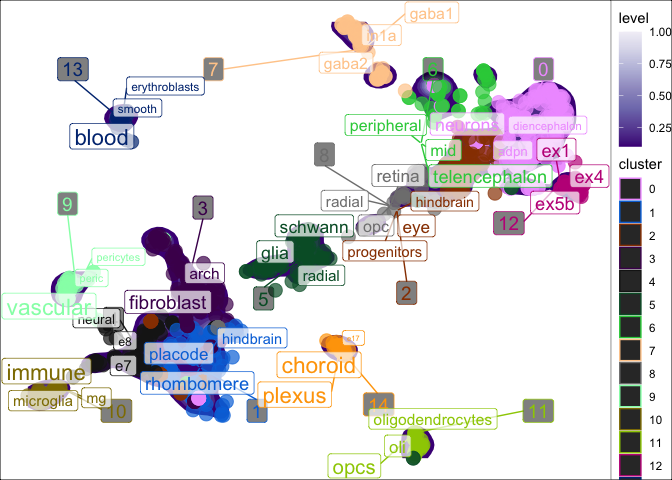

scNLP
================
<h5>
Author: <i>Brian M. Schilder</i>
</h5>
<h5>
Most recent update: <i>Jun-21-2021</i>
</h5>

## Tools for applying natural language processing (NLP) techniques to single-cell (sc) omics data.

# Intro

When trying to re-analyze single-cell \[RNA-seq\] data that has
previously been annotated, the same cell-types are not usually labeled
in the same way (e.g. “Purkinje cells” vs. “purkinje neurons”
vs. “pkj\_neurons”). This makes harmonizing data across multiple source
quite challenging. One solution is to re-annotate all cells yourself.
Alternatively, you can re-use the existing cell-type labels with natural
language processing (NLP).

Term frequency–inverse document frequency (**tf-idf**) is an NLP
technique to identify words or phrases that are enriched in one document
relative to some other larger set of documents.

In our case, our words are within the non-standardized cell labels and
our “documents” are the clusters. The goals is to find words that are
enriched in each cluster relative to all the other clusters. This can be
thought of as an NLP equivalent of finding gene markers for each
cluster.

# [Documentation website](https://neurogenomics.github.io/scNLP/)

# Quick examples

``` r
library(scNLP) 
data("pseudo_seurat")
```

## td-idf annotation

`seurat_tfidf` will run **tf-idf** on each cluster and put the results
in the **enriched\_words** and **tf\_idf** cols of the `meta.data`.

``` r
pseudo_seurat <- run_tfidf(object = pseudo_seurat,
                           reduction = "UMAP",
                           cluster_var = "cluster",
                           label_var = "celltype") 
```

    ## Loading required package: SeuratObject

    ## [1] "+ Extracting data from Seurat object."
    ## [1] "+ Using reduction: umap"

    ## Joining, by = "word"

    ## Joining, by = "cluster"
    ## Joining, by = "cluster"

``` r
head(pseudo_seurat@meta.data)
```

    ##                         cluster       batch species     dataset celltype label
    ## human.DRONC_human.ASC1        5 DRONC_human   human DRONC_human     ASC1  ASC1
    ## human.DRONC_human.ASC2        5 DRONC_human   human DRONC_human     ASC2  ASC2
    ## human.DRONC_human.END         9 DRONC_mouse   mouse DRONC_mouse      END   END
    ## human.DRONC_human.exCA1       0 DRONC_human   human DRONC_human    exCA1 exCA1
    ## human.DRONC_human.exCA3       0 DRONC_human   human DRONC_human    exCA3 exCA3
    ## human.DRONC_human.exDG        0 DRONC_human   human DRONC_human     exDG  exDG
    ##                         nCount_RNA nFeature_RNA RNA_snn_res.0.8 seurat_clusters
    ## human.DRONC_human.ASC1    237.9283          671               5               5
    ## human.DRONC_human.ASC2    232.7748          638               5               5
    ## human.DRONC_human.END     288.9631          616               9               9
    ## human.DRONC_human.exCA1   245.1858          669               0               0
    ## human.DRONC_human.exCA3   225.1575          675               0               0
    ## human.DRONC_human.exDG    237.8823          678               0               0
    ##                             UMAP_1      UMAP_2             enriched_words
    ## human.DRONC_human.ASC1  -0.4796632  0.17629431            asc1; asc2; ast
    ## human.DRONC_human.ASC2  -0.6386602 -0.05231967            asc1; asc2; ast
    ## human.DRONC_human.END   -7.7066403 -1.84134831 vascular; peric; pericytes
    ## human.DRONC_human.exCA1  6.2326443  1.51104526            lpn; adpn; ex6a
    ## human.DRONC_human.exCA3  6.0303471  1.47096417            lpn; adpn; ex6a
    ## human.DRONC_human.exDG   5.9316036  1.49563257            lpn; adpn; ex6a
    ##                                                                           tf_idf
    ## human.DRONC_human.ASC1                                        0.0917983119017698
    ## human.DRONC_human.ASC2                                        0.0917983119017698
    ## human.DRONC_human.END                        0.154992540041713; 0.10415577696547
    ## human.DRONC_human.exCA1 0.0644773857405288; 0.06396517525531; 0.0429849238270192
    ## human.DRONC_human.exCA3 0.0644773857405288; 0.06396517525531; 0.0429849238270192
    ## human.DRONC_human.exDG  0.0644773857405288; 0.06396517525531; 0.0429849238270192

## td-idf scatter plot

You can also plot the results in reduced dimensional space (e.g. UMAP).
`plot_tfidf()` will produce a list with three items. - `data`: The
processed data used to create the plot. - `tfidf_df`: The full
per-cluster TF-IDF enrichment results. - `plot`: The `ggplot`.

### `Seurat` input

``` r
res <- plot_tfidf(object = pseudo_seurat, 
                  label_var = "celltype", 
                  cluster_var = "cluster", 
                  show_plot = T)
```

    ## [1] "+ Extracting data from Seurat object."
    ## [1] "+ Using reduction: umap"

    ## Joining, by = "word"

    ## Joining, by = "cluster"
    ## Joining, by = "cluster"

    ## Warning: Ignoring unknown aesthetics: label

<!-- -->

# Session Info

<details>

``` r
utils::sessionInfo()
```

    ## R version 4.1.0 (2021-05-18)
    ## Platform: x86_64-apple-darwin17.0 (64-bit)
    ## Running under: macOS Big Sur 10.16
    ## 
    ## Matrix products: default
    ## BLAS:   /Library/Frameworks/R.framework/Versions/4.1/Resources/lib/libRblas.dylib
    ## LAPACK: /Library/Frameworks/R.framework/Versions/4.1/Resources/lib/libRlapack.dylib
    ## 
    ## locale:
    ## [1] en_GB.UTF-8/en_GB.UTF-8/en_GB.UTF-8/C/en_GB.UTF-8/en_GB.UTF-8
    ## 
    ## attached base packages:
    ## [1] stats     graphics  grDevices utils     datasets  methods   base     
    ## 
    ## other attached packages:
    ## [1] ggplot2_3.3.4      tidytext_0.3.1     SeuratObject_4.0.2 scNLP_0.1.0       
    ## 
    ## loaded via a namespace (and not attached):
    ##  [1] MatrixGenerics_1.4.0        Biobase_2.52.0             
    ##  [3] maps_3.3.0                  assertthat_0.2.1           
    ##  [5] expm_0.999-6                highr_0.9                  
    ##  [7] gld_2.6.2                   lmom_2.8                   
    ##  [9] stats4_4.1.0                GenomeInfoDbData_1.2.6     
    ## [11] ggrepel_0.9.1               yaml_2.2.1                 
    ## [13] pillar_1.6.1                lattice_0.20-44            
    ## [15] glue_1.4.2                  digest_0.6.27              
    ## [17] GenomicRanges_1.44.0        RColorBrewer_1.1-2         
    ## [19] XVector_0.32.0              colorspace_2.0-1           
    ## [21] htmltools_0.5.1.1           Matrix_1.3-4               
    ## [23] pkgconfig_2.0.3             zlibbioc_1.38.0            
    ## [25] purrr_0.3.4                 mvtnorm_1.1-2              
    ## [27] scales_1.1.1                rootSolve_1.8.2.1          
    ## [29] tibble_3.1.2                proxy_0.4-26               
    ## [31] generics_0.1.0              farver_2.1.0               
    ## [33] IRanges_2.26.0              ellipsis_0.3.2             
    ## [35] withr_2.4.2                 SummarizedExperiment_1.22.0
    ## [37] BiocGenerics_0.38.0         magrittr_2.0.1             
    ## [39] crayon_1.4.1                evaluate_0.14              
    ## [41] tokenizers_0.2.1            janeaustenr_0.1.5          
    ## [43] fansi_0.5.0                 MASS_7.3-54                
    ## [45] SnowballC_0.7.0             class_7.3-19               
    ## [47] tools_4.1.0                 data.table_1.14.0          
    ## [49] lifecycle_1.0.0             matrixStats_0.59.0         
    ## [51] stringr_1.4.0               Exact_2.1                  
    ## [53] S4Vectors_0.30.0            munsell_0.5.0              
    ## [55] DelayedArray_0.18.0         isoband_0.2.4              
    ## [57] compiler_4.1.0              e1071_1.7-7                
    ## [59] GenomeInfoDb_1.28.0         rlang_0.4.11               
    ## [61] grid_4.1.0                  RCurl_1.98-1.3             
    ## [63] dichromat_2.0-0             rstudioapi_0.13            
    ## [65] labeling_0.4.2              bitops_1.0-7               
    ## [67] rmarkdown_2.9               boot_1.3-28                
    ## [69] DescTools_0.99.42           gtable_0.3.0               
    ## [71] DBI_1.1.1                   R6_2.5.0                   
    ## [73] knitr_1.33                  dplyr_1.0.6                
    ## [75] utf8_1.2.1                  pals_1.7                   
    ## [77] stringi_1.6.2               parallel_4.1.0             
    ## [79] Rcpp_1.0.6                  vctrs_0.3.8                
    ## [81] mapproj_1.2.7               tidyselect_1.1.1           
    ## [83] xfun_0.24

</details>
